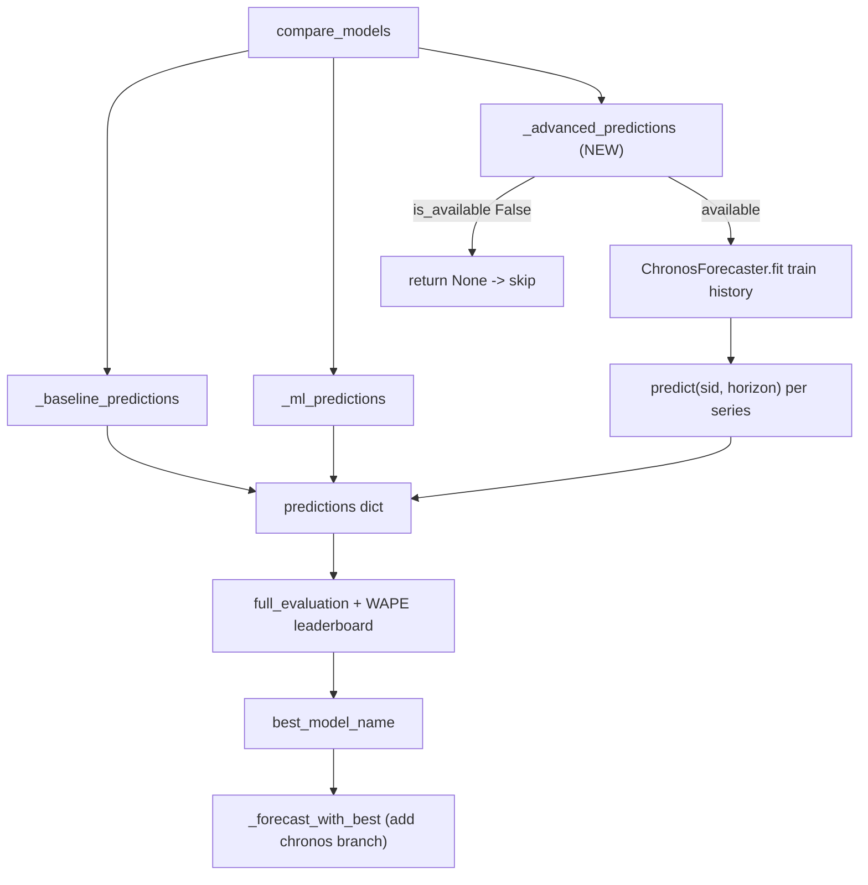

# Plug in Amazon Chronos via AdvancedForecasterInterface (RT-6)

## Goal and chosen path

Add a zero-shot **Chronos-Bolt** forecaster behind the existing `AdvancedForecasterInterface`, make it a first-class model in the holdout backtest, and benchmark its WAPE against `ml_gradient_boosting`.

Per the decision, we keep the existing **Python 3.9.6** `.venv` and install `chronos-forecasting<2` + `torch` (1.5.x supports Python 3.9; 2.x/Chronos-2 needs 3.10+). The adapter defaults to `amazon/chronos-bolt-small` and produces point forecasts via `BaseChronosPipeline.predict_quantiles` (median). All heavy imports are lazy so the base pipeline stays lightweight and **skips Chronos gracefully when the deps are absent**.

## How it fits the current architecture

The backtest in [retail_forecasting_optimization/src/model_selection.py](retail_forecasting_optimization/src/model_selection.py) already iterates generically over a `predictions` dict and picks the lowest overall WAPE, so adding a new entry needs no changes to the metrics/summary loop:

```151:170:retail_forecasting_optimization/src/model_selection.py
    for name, pred in predictions.items():
        ev = full_evaluation(pred)
        ev.insert(0, "model", name)
        metric_frames.append(ev)
        overall = ev[ev["level"] == "overall"].iloc[0]
        summary_rows.append(
            {
                "model": name,
                ...
    best_model_name = summary.iloc[0]["model"]
```

Chronos is naturally a `predict(series_id, horizon)` model (zero-shot, no recursion, no future covariates), so it slots in exactly like a baseline rather than needing the ML model's `forecast_recursive` path.



## File-by-file changes

### 1. New adapter: `src/model_chronos.py`

`ChronosForecaster(AdvancedForecasterInterface)` (import the base from `.model_ml`). Contract mirrors the baselines' `fit`/`predict(series_id, horizon)`:

```python
class ChronosForecaster(AdvancedForecasterInterface):
    name = "chronos"

    def __init__(self, config):
        self.config = config
        self.date_col = config["data"]["date_col"]
        self.target = config["data"]["target_col"]
        c = config["models"].get("chronos", {})
        self.enabled = c.get("enabled", True)
        self.model_id = c.get("model_id", "amazon/chronos-bolt-small")
        self.device = c.get("device", "cpu")
        self.context_length = c.get("context_length")     # optional cap
        self.quantile_level = c.get("quantile_level", 0.5)
        self._history = {}          # sid -> np.ndarray target history
        self._pipeline = None
        self._available = None

    def is_available(self):
        if not self.enabled:
            return False
        if self._available is None:
            try:
                import torch  # noqa
                from chronos import BaseChronosPipeline  # noqa
                self._available = True
            except Exception:
                self._available = False
        return self._available

    def _load(self):
        import torch
        from chronos import BaseChronosPipeline
        if self._pipeline is None:
            self._pipeline = BaseChronosPipeline.from_pretrained(
                self.model_id, device_map=self.device, torch_dtype=torch.float32,
            )

    def fit(self, history_df):           # zero-shot: cache per-series history
        for sid, g in history_df.sort_values(self.date_col).groupby("series_id"):
            self._history[sid] = g[self.target].to_numpy(dtype="float64")
        return self

    def predict(self, series_id, horizon):
        import torch
        self._load()
        hist = self._history[series_id]
        if self.context_length:
            hist = hist[-self.context_length:]
        _, mean = self._pipeline.predict_quantiles(
            context=torch.tensor(hist, dtype=torch.float32),
            prediction_length=int(horizon),
            quantile_levels=[self.quantile_level],
        )
        preds = mean[0].numpy()[:horizon]         # median point forecast
        return np.clip(np.asarray(preds, dtype="float64"), 0, None)
```

Notes: Bolt native horizon is 64 ≥ holdout 28, so no length-limit handling needed. For speed on the full run, series with equal horizons can be batched by passing a `list` of context tensors to `predict_quantiles` (optimization; per-series loop is correct and fine to start).

### 2. Wire into model selection: `src/model_selection.py`

Add `_advanced_predictions(cleaned_df, holdout, config) -> Optional[pd.DataFrame]` mirroring `_baseline_predictions` (fit on `date <= cutoff`, predict `len(g)` per series, emit `date + dims + series_id + actual + forecast`). Return `None` when `not model.is_available()`. Then in `compare_models`, right after the ML block:

```python
adv = _advanced_predictions(cleaned_df, holdout, config)
if adv is not None:
    predictions[ChronosForecaster.name] = adv
```

Same time-based `cutoff` (`holdout_days`) as everything else -> no leakage from holdout actuals.

### 3. Wire into forward forecast: `src/forecasting_pipeline.py`

`_forecast_with_best` currently routes non-ML winners through `get_baseline_models(...)[best_model_name]`, which would `KeyError` on `"chronos"`. Add an `elif best_model_name == ChronosForecaster.name:` branch that fits `ChronosForecaster(config)` on full `cleaned_df` and calls `predict(sid, len(g))` per series, producing the same `forecast_units` / `model` / `horizon_day` columns as the other branches:

```110:128:retail_forecasting_optimization/src/forecasting_pipeline.py
    if best_model_name == MLForecaster.name:
        ml_model.set_history(cleaned_df)
        ...
    else:
        models = get_baseline_models(config)
        model = models[best_model_name]
```

### 4. Config: `config/config.yaml`

Add under `models:` (next to `ml_params` / `sarimax`):

```yaml
  chronos:
    enabled: true
    model_id: amazon/chronos-bolt-small
    device: cpu
    torch_dtype: float32
    context_length: 512
    quantile_level: 0.5
```

`enabled: true` is safe because `is_available()` still returns `False` (and Chronos is skipped) whenever the package/torch is not installed.

### 5. Dependencies

Install into the existing venv (from `retail_forecasting_optimization/`):

```bash
./.venv/bin/pip install "chronos-forecasting<2" torch
```

Keep the base `requirements.txt` lightweight (consistent with the lazy-import/optional design). Add a clearly-labeled **optional/commented** block documenting the install, and a one-line note in README §11. First model load downloads `chronos-bolt-small` weights from HuggingFace once (network required).

## Tests (`tests/test_model_chronos.py`)

Designed so `pytest -q` stays green and offline whether or not Chronos is installed:

- **Graceful skip:** with `enabled: false` (and, in a second case, a monkeypatched import that raises), `ChronosForecaster.is_available()` is `False` and `_advanced_predictions(...)` returns `None`.
- **Integration wiring (no heavy deps):** monkeypatch `model_selection.ChronosForecaster` with a `FakeChronos` (name `"chronos"`, `is_available()->True`, `predict` returns a deterministic series). Assert `"chronos"` appears in `compare_models(...)["predictions"]` and in the `summary` leaderboard; force it to be most accurate and assert `_forecast_with_best` routes through the new branch.
- **Optional live smoke:** `pytest.importorskip("chronos")` + `importorskip("torch")`, gated behind an env var (e.g. `RUN_CHRONOS_SMOKE=1`) so default runs don't hit the network; fits on the tiny `sample_df` and asserts output shape and non-negativity.

## Benchmark (acceptance criteria)

From `retail_forecasting_optimization/`:

1. Smoke: `./.venv/bin/python main.py --quick` (confirms Chronos participates; weights download once).
2. Full: `./.venv/bin/python main.py` (writes `outputs/model_metrics.csv` with `chronos` rows; leaderboard prints in the executive summary).
3. Compare `chronos` vs `ml_gradient_boosting` overall WAPE plus slices (department, channel, lifecycle, promo vs non-promo) from `outputs/model_metrics.csv`.
4. Write a short "where Chronos wins/loses" summary (surface in the chat and, if desired, as a comment on RT-6).
5. Confirm `./.venv/bin/python -m pytest -q` passes.

## Notes / non-goals

- Explainability stays ML-based (`generate_explainability(..., comparison["ml_model"], ...)`); Chronos has no feature importances. Harmless if Chronos wins; noted in README.
- Out of scope (per ticket): TimesFM/PatchTST adapters, Chronos-2/`predict_df`, model registry refactor.